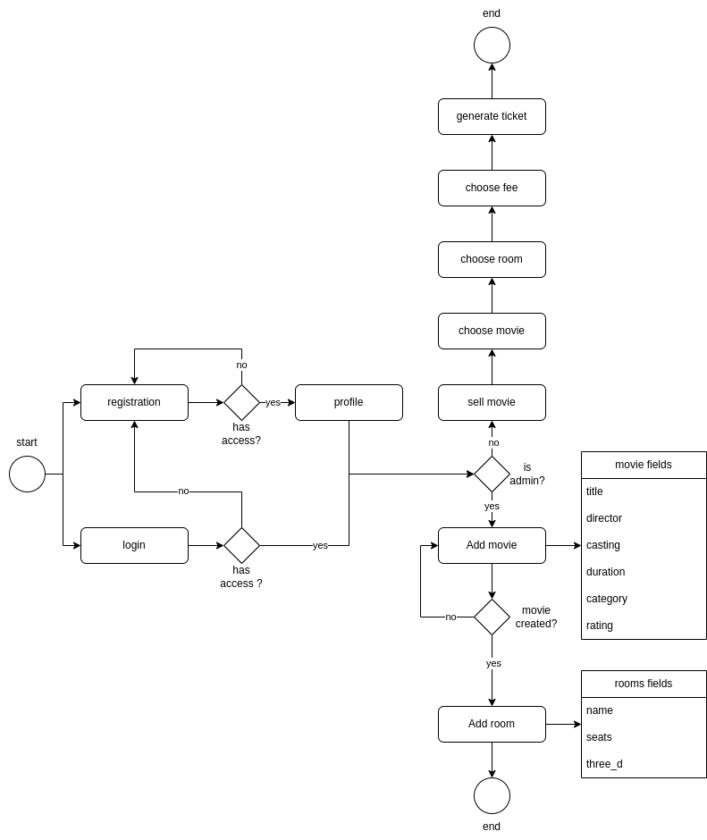
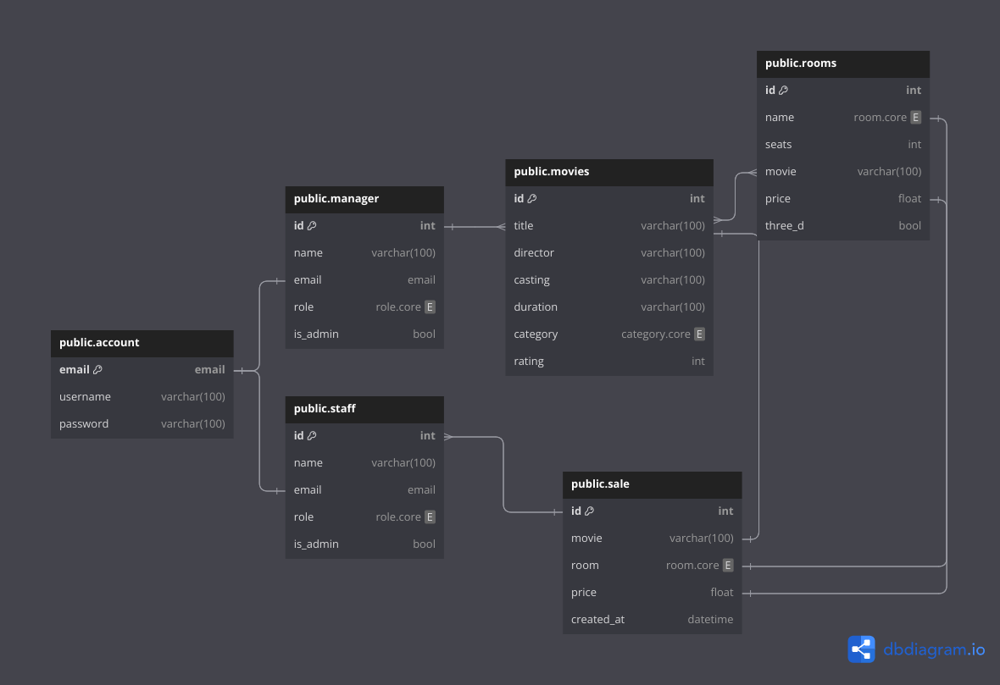

# Theater Project - FATEC

This is a Movie Theater ticket sale application which is part of Programming Languages class ministrated by professor Argemiro Pentian. The main objective was to create a software which should contain two different permissison logins, one for a manager and another for staff.<br>
The manager has permission to:<br>

* Create a Room,
* Create Movies.

While the staff has permission to:

* Sell the ticket which contains movie, room, seat and price.

## Campus - Ary Fossen / Jundiaí

This project was formed by a group of five people:

* Juliana Perez
* Kaique Baradel
* Nicoli Mecati
* Ralph Souza
* Thiago Henrique Almeida

Students in the Information Technology Management graduation course.

# MER - Entity-Relationship Model

<div style="display: inline-block">
     
</div>

# DER - Entity-Relationship Diagram

<div style="display: inline-block">
     
</div>

# Usage

Once you have copied the directory to your machine from Github the first step is to create a virtual machine through the following command:

```
$ python3 -m venv <name-of-your-virtual-machine>
```

After that we are going to access the virtual environment with the following command:

```
$ source <name-of-your-virtual-machine>/bin/activate
```

The next step requires us to install a group of libraries in order to run the application, which we will do using the following command:

```
$ pip install -r requirements.txt
```

Now we are going to set our Database, in this case we are using a simple SQLite3 system. To do that we are going to execute two others commands one to create our set or tables and another to create them. Just copy and paste the following commands in the order below:

```
$ ./manage.py makemigrations
```

```
$ ./manage.py migrate
```

Now we can run our application locally using the **runserver** command:

```
$ ./manage.py runserver
```